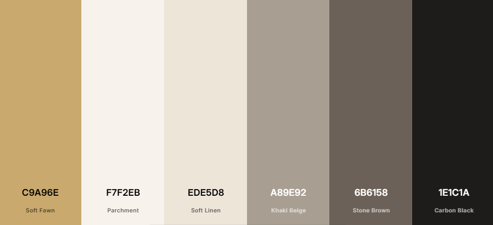
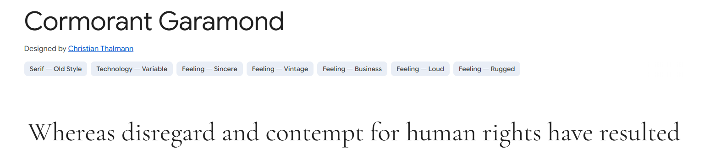
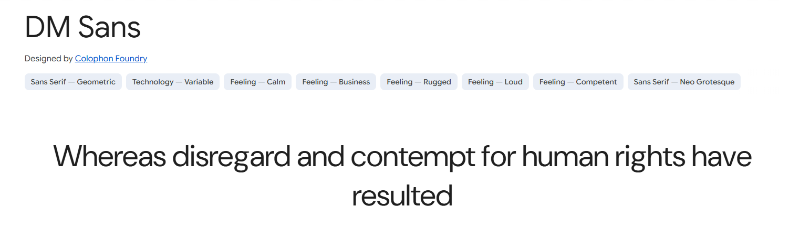
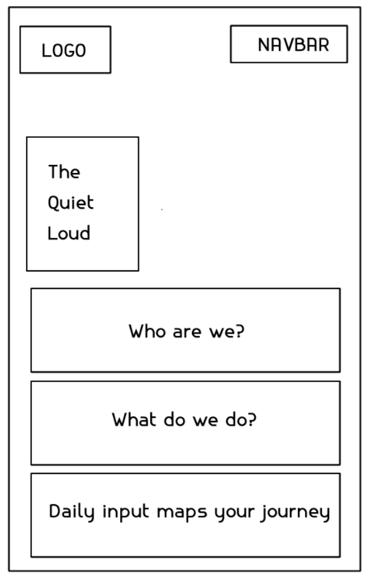
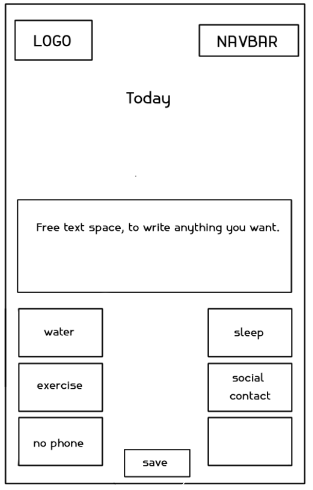
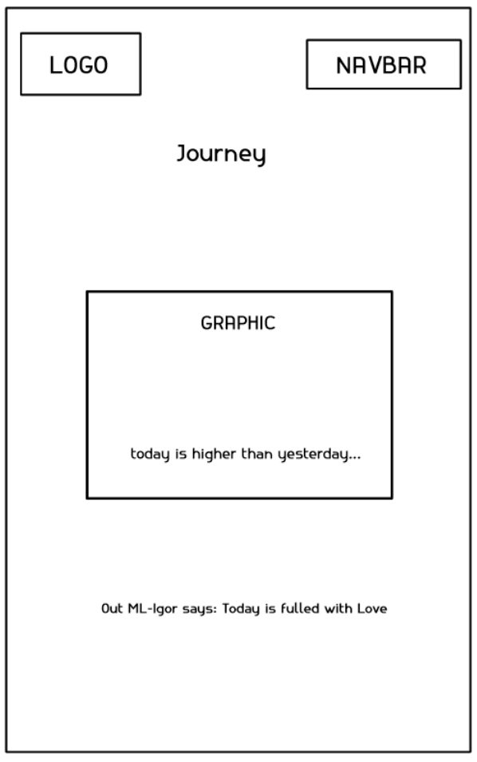
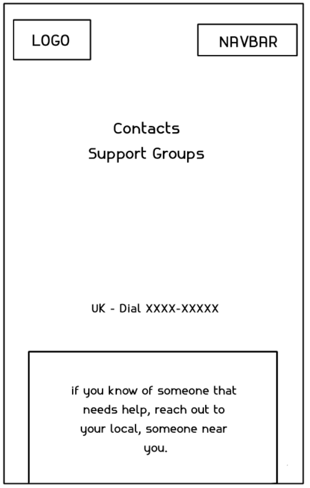

<div align="center">
 

# The Quiet Loud 🌿

> *"Turning your inner critic into your biggest fan."*

🌐 **[Live App](https://the-quiet-loud-2c55ac9d2764.herokuapp.com/)** | 📁 **[GitHub Repository](https://github.com/JaimeHyland/the-quiet-loud)**

</div>

---
## Table of Contents
- [The Story Behind It](#the-story-behind-it)
- [User Experience](#user-experience)
  - [Our Philosophy](#our-philosophy)
  - [Types of Users](#types-of-users)
  - [User Stories](#user-stories)
  - [User Flow](#user-flow)
- [Design](#design)
  - [Colour Scheme](#colour-scheme)
  - [Typography](#typography)
  - [Wireframes](#wireframes)
  - [Frontend Structure](#frontend-structure)
  - [Backend Structure](#backend-structure)
- [Features](#features)
- [Data & Machine Learning](#data--machine-learning)
- [Responsiveness](#responsiveness)
- [Testing](#testing)
- [Technologies and Languages](#technologies-and-languages)
- [Deployment](#deployment)
- [Team](#team--plot-twist-)
- [Credits](#credits)


# The Quiet Loud 🌿

> *"Turning your inner critic into your biggest fan."*

---

Some of us carry a voice that never quite lets up. It second-guesses, it criticises, it replays. It's loud — even when we're quiet.

The Quiet Loud is a space to meet that voice with something gentler. Write freely. Track the small things that shape your days. And over time, watch your language — and your life — begin to shift.

This is not a therapy app. It won't diagnose you or rate your feelings on a scale of one to ten. It will simply listen, reflect, and respond with kindness.

*[Live app — link TBC Monday 3 March]*

A "With Heart" hackathon project: a web app that helps users write freely about how they feel, receive a warm and human-centred emotional response, and track the small daily habits that make them thrive.

Underpinning the experience is a data analytics layer built on a real-world sentiment and emotion dataset. Using machine learning, the app analyses the user's own words to detect emotional tone — not to diagnose, but to respond with kindness. Over time, the app surfaces meaningful patterns: which habits correlate with better days, how language shifts, and what small changes make the biggest difference to wellbeing. The data doesn't drive the app — it gives it heart.

---

# The Story Behind It

This project was built by a team of seven people across different time zones, skill levels, and life circumstances — as part of a February 2026 hackathon.

Two of our team members couldn't complete the journey due to real-life circumstances beyond their control. Those who remained showed up anyway — learning, collaborating, debugging at 3am, and building something they genuinely believe in. That, in itself, is worth celebrating. 👏

---

# User Experience

## Our Philosophy
This app was built with clear ethical boundaries from the start:

- ✅ **No emoji scales or number ratings** — reductive and patronising
- ✅ **No mental health diagnosis or clinical labels** — we are not clinicians
- ✅ **No analysing anyone but yourself** — first person only
- ✅ **Free text only** — write in your own words, as messy as you need
- ✅ **Always signpost professional help** — visible, warm, never hidden in small print

> *"This app is a space for kindness, not diagnosis. If you're struggling, please reach out to someone qualified to help."*

---

## Types of Users
- People who want to build kinder self-talk habits
- Tech workers experiencing imposter syndrome or workplace stress
- Anyone who wants to understand what small habits make them feel better
- Neurodivergent users who may benefit from gentle emotional reflection support

## User Stories

These aren't just features — they're promises to the people who use this app.

- As a user, I can write freely about how I feel without being judged or rated
- As a user, I receive a warm, supportive reframe based on my emotional tone — not a label
- As a user, I can log simple daily habits that matter: sleep, movement, time outside, connection
- As a user, I can write one thing I'm grateful for today — however small
- As a user, I can see my patterns and streaks over time, and notice what actually makes me feel better
- As a user, I can always find warm, clear signposting to professional support — without having to dig for it
- As a user, I can move easily between all areas of the app, on any device

## User Flow
1. User registers / logs in
2. User writes freely — how they feel today, in their own words
3. User logs simple daily habits
4. User adds one gratitude entry
5. App returns a warm, encouraging reframe based on emotional tone — never a clinical label
6. User can view their Journey dashboard — streaks, word cloud, habit patterns
7. User can explore Insights — evidence-based wellbeing data
8. Support page always accessible — professional help signposting

---

# Design

## Name & Tagline
**The Quiet Loud**
*Your loudest thoughts, softened.*

The name captures the tension at the heart of the app — the loud, relentless inner critic that so many people carry silently. The app creates a space to soften that voice.

## Colour Scheme
Soft neutrals keep the space gentle and welcoming, while the darker tones provide grounding and clarity. Together, the palette reflects the app's purpose: creating an environment where users can slow down, breathe, and be honest with themselves.

The colour palette was generated using [Coolors](https://coolors.co/c9a96e-f7f2eb-ede5d8-a89e92-6b6158-1e1c1a).

| Variable | Hex | Use |
|----------|-----|-----|
| `--cream` | `#f7f2eb` | Background |
| `--warm` | `#ede5d8` | Section backgrounds |
| `--gold` | `#c9a96e` | Accents, highlights |
| `--dark` | `#1e1c1a` | Text, buttons |
| `--mid` | `#6b6158` | Secondary text |
| `--light` | `#a89e92` | Placeholder text |



## Typography

### Cormorant Garamond — Headings
An elegant serif font that adds sophistication and a calm, reflective tone. Its delicate curves make headings feel distinctive and warm. [Google Fonts](https://fonts.google.com/specimen/Cormorant+Garamond)



### DM Sans — Body Text
A modern, geometric sans-serif font. Clean, highly legible, and accessible. Pairs beautifully with Cormorant Garamond for a professional yet gentle feel. [Google Fonts](https://fonts.google.com/specimen/DM+Sans)



[Font Awesome](https://fontawesome.com/) icons are used throughout to keep the interface clean and visually intuitive.

## Wireframes

Wireframes were created by the team to plan the layout and structure of each page.

| Wireframes | | | |
| --- | --- | --- | --- |
|  |  |  |  |
| Homepage | Today | Journey | Support |
---

## Frontend Structure
The frontend follows a modular Django templates architecture with separate CSS and JS files per page, allowing multiple team members to work simultaneously without merge conflicts.

```
frontend/
├── assets/
│   ├── css/          # Per-page stylesheets (base, home, today, journey, support, auth)
│   ├── js/           # Per-page JavaScript (base, home, today, journey, support)
│   └── images/
│       └── favicon/  # Full favicon set + webmanifest
├── templates/
│   ├── account/      # login.html, logout.html, signup.html
│   ├── includes/     # _header.html, _header_app.html, _header_support.html, _footer.html
│   ├── base.html     # Base template
│   ├── base_app.html
│   ├── base_support.html
│   ├── index.html    # Landing page
│   ├── today.html    # Daily entry
│   ├── journey.html  # Dashboard
│   ├── support.html  # Resources
│   └── 404.html
```

## Backend Structure
```
backend/
├── django_backend/   # Project settings, URLs, WSGI
├── ml_model/         # Trained ML model files
│   ├── nn_model.pkl          # MLPClassifier (scikit-learn)
│   ├── label_encoder.pkl
│   └── tfidf_vectorizer.pkl
└── thought_shift/    # Main Django app
    ├── models.py
    ├── views.py
    ├── admin.py
    └── migrations/
```

## URL Structure
All internal navigation links use Django URL routing with trailing slashes (e.g. `/today/`, `/journey/`). This ensures compatibility with Django's URL dispatcher. Relative `.html` paths will not work once the app is served through Django — all href values must follow the `/path/` format.

---

# Features

## Current Features
- 🏠 **Landing page** — warm introduction to The Quiet Loud
- 📝 **Daily entry page** — free text, habit toggles, gratitude input
- 🌿 **Journey dashboard** — streaks, word cloud, habit patterns
- 💡 **Insights page** — evidence-based wellbeing data visualisations
- 🆘 **Support page** — professional help signposting
- 🔐 **User authentication** — register, login, logout
- 💾 **Saved history** — entries stored per user

## Future Features
- Emotion trend visualisation over time
- Personalised habit recommendations based on patterns
- Anonymous community gratitude wall
- Export your journey as a PDF

---

# Data & Machine Learning

## Emotion Detection Model 🎭

The app uses a custom-trained machine learning model to detect emotions from free text input. Built and trained by our data analytics team using a dataset of over **400,000 sentences**.

## The Dataset
- **Source:** [Sentiment and Emotion Analysis Dataset](https://www.kaggle.com/datasets/kushagra3204/sentiment-and-emotion-analysis-dataset) — Kaggle
- **Original size:** 400,000+ labelled sentences
- **Challenge:** The dataset was heavily unbalanced — some emotions had far more examples than others
- **Solution:** Undersampling to balance all categories to ~15,000 examples per emotion
- **Cleaning:** Removed ~6,600 duplicates, dropped very short sentences, cleaned punctuation, added manually collected short emotion examples

## The Six Emotions
The model classifies text into six emotional categories:

| Emotion | Emoji |
|---------|-------|
| Joy | 😊 |
| Sadness | 😢 |
| Anger | 😠 |
| Fear | 😨 |
| Love | ❤️ |
| Surprise | 😮 |

## Models Trained & Compared

Three models were built and compared:

| Model | Accuracy |
|-------|----------|
| 🥇 Simple Neural Network (2 layers: 128, 64 neurons) | **90.38%** |
| 🥈 Deeper Neural Network (3 layers: 256, 128, 64 + batch norm) | 89.87% |
| 🥉 Random Forest | 89.43% |

**Winner: Simple Neural Network** — proving that simpler is often better.

## Performance by Emotion
- **Love** and **Surprise** — easiest to detect (92%+ F1-score)
- **Joy, Anger, Sadness** — solid performance (88–91%)
- **Fear** — most nuanced, hardest to detect (~87% F1-score)

## Key Learnings
- A balanced dataset made a significant difference to model performance
- TF-IDF text vectorisation held its own against more modern approaches
- The simplest model outperformed the most complex one
- Some emotions (fear) are genuinely harder to detect than others

## Deployment
The model is saved with its preprocessing tools and integrated into the Django backend.

> ⚠️ **Important:** The final deployed model uses **scikit-learn's MLPClassifier** (saved as `.pkl`), NOT the original Keras model. This switch was made to reduce the Heroku slug size — TensorFlow alone was over 450MB, pushing the total slug to 788MB against Heroku's 500MB limit. The MLPClassifier performs comparably (~90% accuracy) at a fraction of the size.

Saved files:
- `nn_model.pkl` — trained MLPClassifier neural network (scikit-learn)
- `tfidf_vectorizer.pkl` — TF-IDF text vectoriser
- `label_encoder.pkl` — emotion label encoder

```python
import pickle
import numpy as np

with open('nn_model.pkl', 'rb') as f:
    load_model = pickle.load(f)
with open('tfidf_vectorizer.pkl', 'rb') as f:
    tfidf = pickle.load(f)
with open('label_encoder.pkl', 'rb') as f:
    label_encoder = pickle.load(f)

user_answer = ["I feel so grateful today"]
user_nn = tfidf.transform(user_answer)
user_dense = user_nn.toarray()

y_pred = load_model.predict(user_dense)[0]
predicted_emotion = label_encoder.inverse_transform([y_pred])[0]
confidence = np.max(load_model.predict_proba(user_dense)[0])

print(f"Predicted emotion: {predicted_emotion} ({confidence*100:.2f}%)")
```

## Ethical Framework
The model output is **never shown directly to the user as a label.** The detected emotional tone is used to select a warm, human-centred supportive response. The app does not diagnose, assess, or classify users — it simply responds with kindness.

This ethical boundary was a deliberate design decision informed by clinical healthcare experience within the team.

---

# Responsiveness
The app is designed mobile-first and tested across devices.

---

# Testing
Due to time constraints and reduced team capacity over the course of the hackathon, formal automated testing was not implemented in this iteration. Manual testing was carried out across key user journeys — registration, login, daily entry submission, and navigation between pages.

Automated testing is noted as a priority for future development.

---

# Technologies and Languages

## Languages
- HTML5
- CSS3
- JavaScript
- Python

## Frameworks, Libraries & Tools
- Django — Python framework and authentication
- Django REST Framework — API endpoints
- Supabase / PostgreSQL — database
- Keras / TensorFlow — used during model training and comparison (not in production)
- Scikit-learn — MLPClassifier for production model, TF-IDF vectorizer, label encoder
- Pandas, NumPy — data processing
- Plotly / Seaborn — data visualisations
- Font Awesome — icons
- Heroku — deployment
- Git — version control
- GitHub — development workflow
- Google Fonts — typography

---

# Deployment

## Live App
*Deployed on Heroku — link TBC Monday 3 March*

> ⚠️ **Please note:** The app is hosted on Heroku's eco tier. If it has been inactive, the first load may take 30–60 seconds to wake up. This is normal — please be patient on first visit. Once running, the app performs as expected.

## Heroku Deployment
1. Create a Heroku account and install the Heroku CLI
2. Log in: `heroku login`
3. Create a new app: `heroku create the-quiet-loud`
4. Set environment variables in Heroku dashboard (DATABASE_URL, SECRET_KEY, DEBUG)
5. Push to Heroku: `git push heroku main`
6. Run migrations: `heroku run python manage.py migrate`

## Local Setup
1. Clone the repository: `git clone https://github.com/JaimeHyland/the-quiet-loud`
2. Navigate to the backend: `cd backend`
3. Install requirements: `pip install -r requirements.txt`
4. Create a `.env` file with your `DATABASE_URL` and `SECRET_KEY`
5. Run migrations: `python manage.py migrate`
6. Start the server: `python manage.py runserver`

## Creating a Fork
1. Navigate to the repository
2. Click the arrow next to the Fork button
3. Select Create new fork
4. Copy the main branch
5. Click Create a fork

## Cloning a Repository
1. Navigate to the repository
2. Click the green Code button
3. Copy the link
4. Open a terminal and navigate to your chosen directory
5. Run `git clone` and paste the link
6. Press enter

---

# Team — Plot Twist 🎉

Seven people. Different time zones. Different skill levels. Different life circumstances. One app.

Two of our team couldn't complete the journey — real life stepped in, as it sometimes does. We built this in their spirit too. 🙏

| Name | Role | LinkedIn |
|------|------|----------|
| Kat | Scrum Master · Frontend | [kakilian](https://www.linkedin.com/in/kakilian) |
| Jaime *(pronounced: Hy-me)* | Backend · Django · Auth | [language-landscapes](https://www.linkedin.com/in/language-landscapes/) |
| Christopher *(aka. James)* | Backend · Testing | [christopher-bracken](https://www.linkedin.com/in/christopher-bracken-0b7263314/) |
| Igor | Data Analytics · ML Model | [48at9vev-code](https://github.com/48at9vev-code) |
| Natalia | Frontend · UI | [natalia-czeladka](https://www.linkedin.com/in/natalia-czeladka/) |
| Abby | Documentation · Support | [abbyhumphreys](https://www.linkedin.com/in/abbyhumphreys/) |
| Emmy | Team member 🙏 | [Emmy-Dare274](https://www.linkedin.com/in/Emmy-Dare274) |

---

# Credits
- [Kaggle dataset](https://www.kaggle.com/datasets/kushagra3204/sentiment-and-emotion-analysis-dataset) — Sentiment and Emotion Analysis
- [Coolors](https://coolors.co) — colour palette generator
- [Google Fonts](https://fonts.google.com) — Cormorant Garamond & DM Sans
- [Font Awesome](https://fontawesome.com) — icons
- [Claude](https://claude.ai) — code assistance and checking
- [ChatGPT](https://chat.openai.com) — code assistance and checking
- [DeepSeek](https://chat.deepseek.com) — code assistance and checking


<br>


<div align="center">

> *"If you want to go fast, go alone.......  
If you want to go far, go together."*
> — African Proverb

</div>

<br>